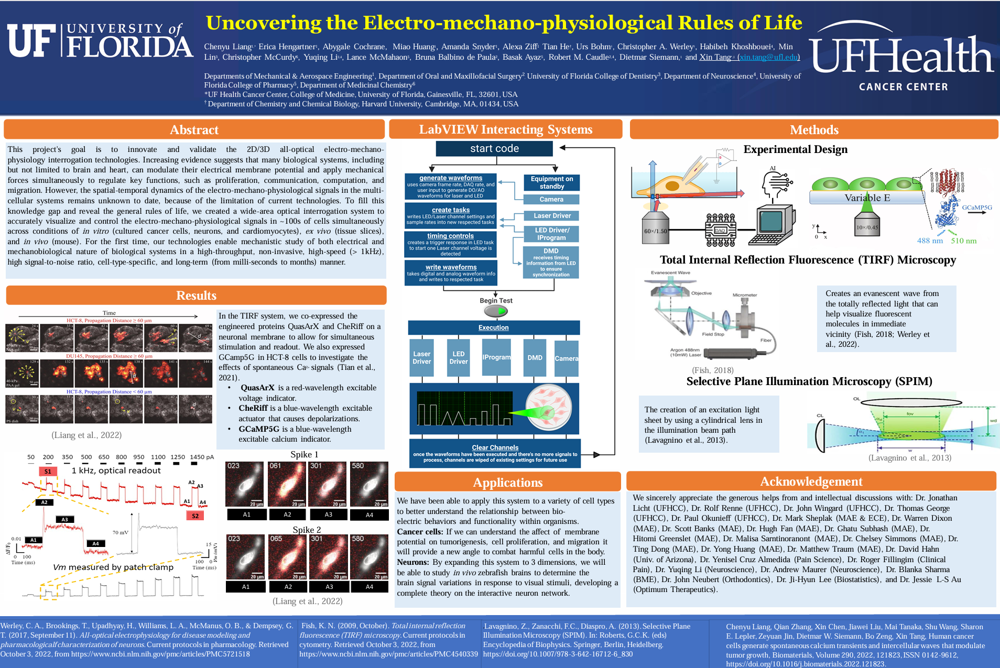
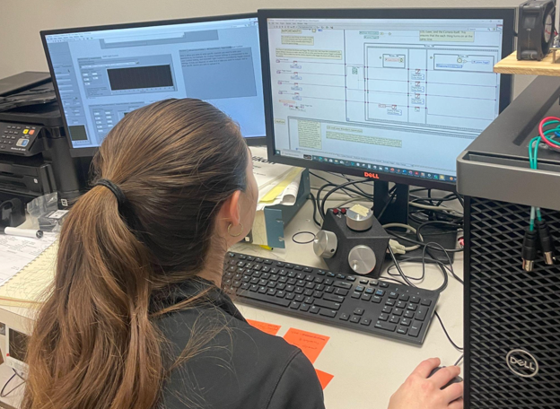
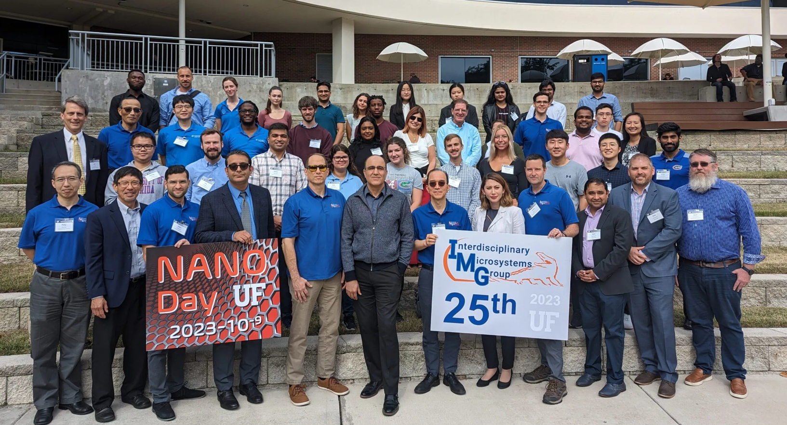

# Electrical Engineer 

## Personal Projects

- [Moxon-Yagi Antenna](assets/img/Moxon_Yagi_Antenna.pdf)
- Grating Lobe Derivation & Impacts on Phased Arrays
- The Significance of the Fourier Transform in Far-Field Patterns

## Integrative Mechano-Biology Lab 
;
;
;

- [NanoDay 2023 Presentation](https://docs.google.com/presentation/d/16tzIVDUpMk8s4q18WKJwFUfhQzm4VMU3/edit?slide=id.p1#slide=id.p1)
- [Weibo Presentation](https://docs.google.com/presentation/d/11BPAZIEaXcrfx8lT12a-w9wwKtHo7rUT/edit?slide=id.p1#slide=id.p1)

## Education
- B.S. Physics, University of Florida
    - Cum Laude, 3.53 GPA
    - Minor in Electrical Engineering, UF
- M.S Electrical Engineering, Johns Hopkins (Current)

## Classwork

### Advanced Lab II
- Lab Report - X-ray Spectroscopy
- [Lab Report - Visible Spectroscopy](https://github.com/a6ygale/a6ygale.github.io/blob/e48084873c3d6cbe24a312a6f62ba95a856d1ee0/assets/img/Visible_Spectroscopy%20(1).pdf)
- Lab Report - Superfluid Helium
- [Final Presentation - Pulsed Nuclear Magnetic Resonance](https://docs.google.com/presentation/d/1pHcAVXH9ZDpeaIiw2J9eQhSS1wjrTK2e/edit?slide=id.p1#slide=id.p1)

### Optics
- [Final Presentation - An Overview of Holography](https://docs.google.com/presentation/d/19Jo9PIW5ZF9VZi4H9p8phfaJDzBp4fLY/edit?usp=sharing&ouid=103744567988756133981&rtpof=true&sd=true)
  
### Programming I for Electrical Engineers
- [Assignments](https://github.com/a6ygale/Programming-I)

### Programming II for Electrical Engineers (DSA)
- [Assignments](https://github.com/a6ygale/Programming-II/tree/main)
- [Excursion 1](https://github.com/a6ygale/Excursion-1) : Group project to determine current and voltage values within nodes of circuit by automatically computing KVL/KCL equations. 
- [Excurison 2](https://github.com/a6ygale/Excursion-2/tree/prototype) : Group project dedicated to calculating minimum cost of logic gate circuits by implementing NAND/NOR equivalent trees.

  
